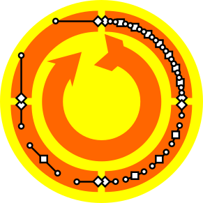

Online SVG Path Simplifier

## Introduction

## Principles

## Actions
- Merge close vertices with given tolerance
- Merge consecutive `H`, `h`, `V` or `v` segments
- Merge consecutive rectilinear `L` or `l` segments with given tolerance
- Merge consecutive curved segments
- ...